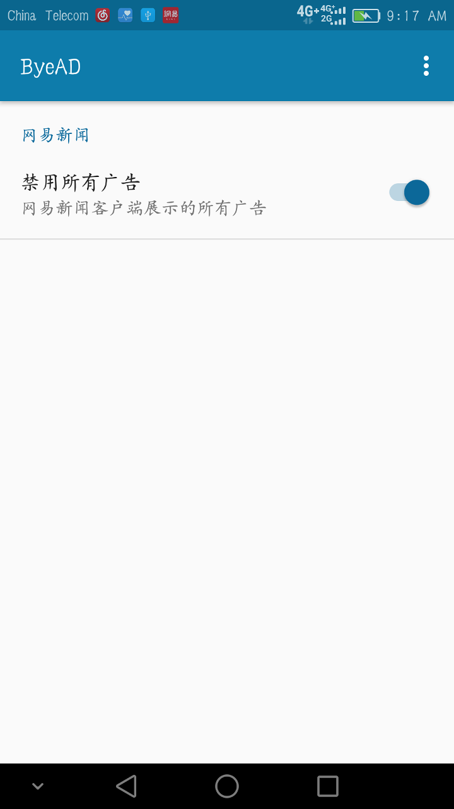

### 移除新闻类的APP中插入的广告

* 目前支持网易新闻客户端v29.1,v31.0版本

### 模块说明
* __app__ 模块处理移除广告的功能
* __load__ 模块用于动态加载来调试移除广告模块的功能

### Xposed Module Repository 
[http://repo.xposed.info/module/com.sky.xposed.rmad](http://repo.xposed.info/module/com.sky.xposed.rmad)

### 截图

## License

    Copyright 2017 The sky Authors

    Licensed under the Apache License, Version 2.0 (the "License");
    you may not use this file except in compliance with the License.
    You may obtain a copy of the License at

       http://www.apache.org/licenses/LICENSE-2.0

    Unless required by applicable law or agreed to in writing, software
    distributed under the License is distributed on an "AS IS" BASIS,
    WITHOUT WARRANTIES OR CONDITIONS OF ANY KIND, either express or implied.
    See the License for the specific language governing permissions and
    limitations under the License.